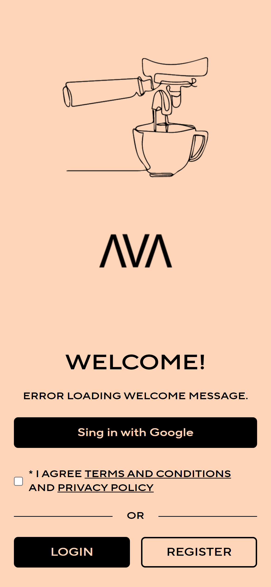
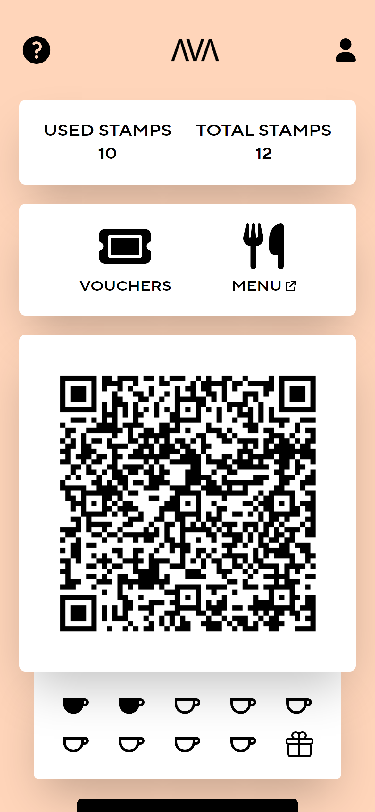

# Cafe AVA - Coffee Pass

## Overview

Cafe AVA - Coffee Pass is a web-based platform designed to provide users with easy access to Cafe AVA's services. Its core feature is serving as a coffee pass for customers, offering rewards based on coffee purchases. Additionally, it includes a coupon feature and various functionalities for employees to manage coupons, stamps, and customer information.

## Features

- **Coffee Passport**: Customers collect stamps and earn rewards based on coffee purchases.
- **Coupon Feature**: Distributes various offers and benefits to customers.
- **Administration Functions**: Employees manage coupons, stamps, and customer information.

## Screenshots




## Technology Stack

- **Framework**: Next.js
- **Database & Authentication**: Supabase

# Setting Up Locally

## Prerequisites

- Docker installed
- Package manager (Brew for MacOS and Linux, Scoop for Windows)

## Installation

1. **Clone repository**:

   ```bash
     git clone https://github.com/JumppanenTomi/coffee-pass
   ```

   or if you are planning to use project in production you should fork it.

1. **Install Docker**: Download and install Docker from [here](https://www.docker.com/get-started/).

1. **Install Package Manager**:

   - For MacOS and Linux, use [Brew](https://brew.sh/).
   - For Windows, use [Scoop](https://scoop.sh/).

1. **Install Supabase CLI**:

   - **Using Brew**:

     ```bash
     brew install supabase/tap/supabase
     ```

   - **Using Scoop**:

     ```bash
     scoop bucket add supabase https://github.com/supabase/scoop-bucket.git
     scoop install supabase
     ```

1. **Login to Supabase CLI and Link Project with Remote (Optional)**:

   - Sign in to Supabase CLI:

     ```bash
     supabase login
     ```

   - Link your local project with the remote project:

     ```bash
     supabase link
     ```

## Database Setup

1. **Start Supabase Stack**: Navigate to your project folder and start the Supabase stack:

   ```bash
   start supabase
   ```

2. **Update Environment Variables**: Copy the `anon` and `service_role` keys from the startup prompt and paste them into your `.env.local` file.

3. **Pull Latest Database Changes (Optional)**:

   ```bash
   supabase db pull
   ```

4. **Apply latest migration**:

   ```bash
    supabase migration up
   ```

## Running the Application

1. **Start the Application**:

   ```bash
   npm run dev
   ```

2. **Access the Application**: Navigate to [http://localhost:3000](http://localhost:3000) to view the application.

3. **Grant Admin Access**: After registering in the application, add your user to the `user_roles` table as an owner or a barista. Access admin features at [http://localhost:3000/admin/](http://localhost:3000/admin/).

## Contributors

- Tomi Jumppanen
- Dat Pham
- Tuomas Heikkilä
- Anton Tugushi

## License

Source code is licensed under the [MIT License](https://opensource.org/licenses/MIT). However, the use of any Cafe AVA branding, such as logos, is prohibited.
